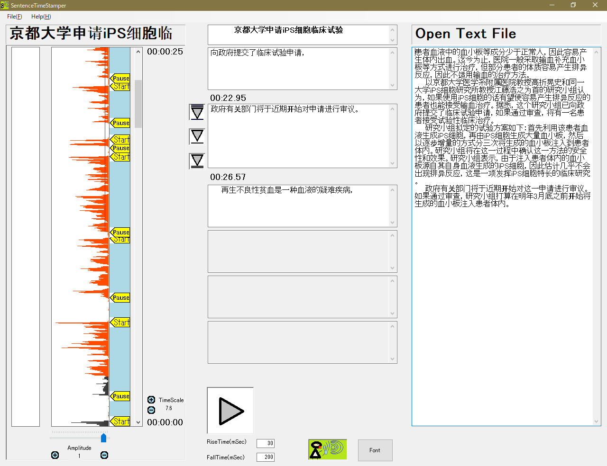
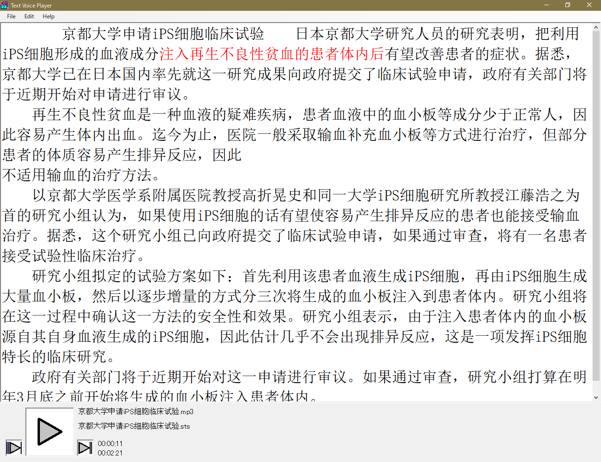

# SentenceTimeStamper

### 注意：
このアプリは、現在ソースコードをダウンロードしてもうまくビルドできないことがあります。
（現状、私のPCではリビルドできるのですが、、、）


## アプリの説明
このアプリケーション[SentenceTimeStamper](https://github.com/let-us-study-with-textvoice/SentenceTimeStamper)は、
mp3など音声ファイルとその内容を書き起こしたテキストファイルから、
音声に同期したテキスト部分を強調して表示させるために、テキストファイルに時間タグを埋め込むための
語学学習用のソフトウエアである。



時間タグを埋め込んだテキストファイルは、拡張子がstsになり、フォーマットは次のようになる。
これは、音楽ファイルにその歌詞を表示させるlrcファイルの考え方を拡張した。

フォーマット
```
[開始時間(分:秒.1/100秒)]テキスト文字[/終了時間(分:秒.1/100秒)]
```
stsファイルの実際の例
```
[00:01.03]　　日本京都大学研究人员的研究表明，[/00:03.74][00:04.10]把利用iPS细胞形成的血液成分[/00:07.42][00:07.68]注入再生不良性贫血的患者体内后[/00:11.00][00:11.39]有望改善患者的症状。[/00:13.20][00:14.01]据悉，[/00:14.31][00:14.76]京都大学已在日本国内率先就这一研究成果[/00:18.63][00:18.84]向政府提交了临床试验申请，[/00:21.76][00:22.95]政府有关部门将于近期开始对申请进行审议。[/00:26.57]
```


## stsファイルを再生表示するためには、
stsファイルを再生させるためには、[TextVoicePlayer](https://github.com/let-us-study-with-textvoice/TextVoicePlayer)を
使うと、再生できます。

stsファイルを再生アプリ：[TextVoicePlaye](https://github.com/let-us-study-with-textvoice/TextVoicePlayer)の紹介


また今後TextVoicePlayerforAndroidを開発したいと思います。


## 使用した技術
このアプリは、NAudioを使っています。一部ソースコードをいじっています。SentenceTimeStamperは４年ほど前に作った
アプリで、開発当時の事を忘れてしまい、どこをいじったか分かりません。（また、開発メモはHDDが壊れたため、
無くなってしまいました。）
